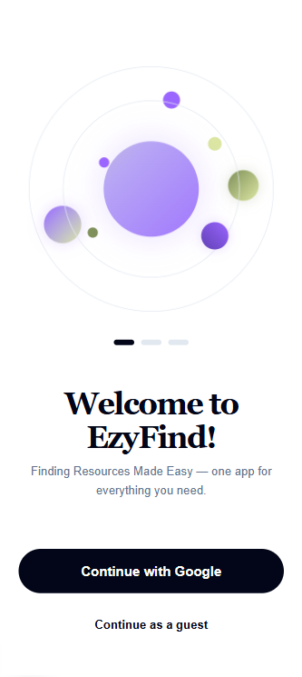
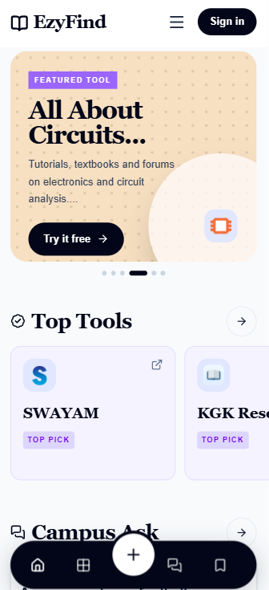
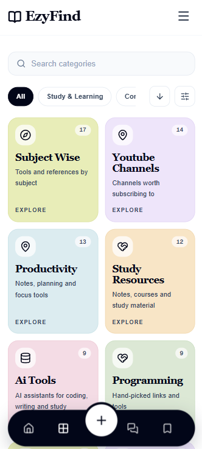
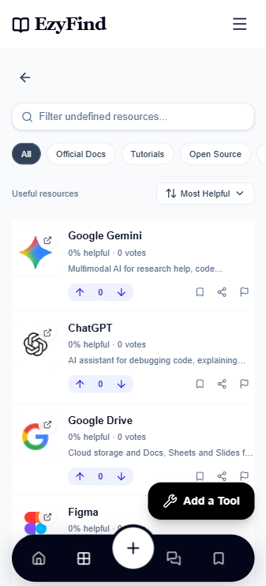
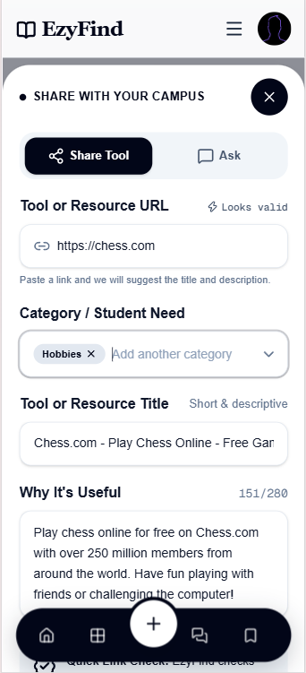
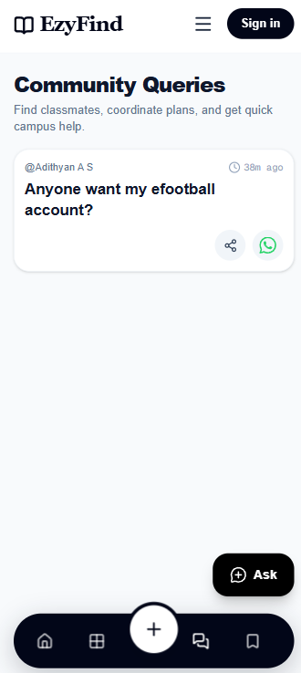
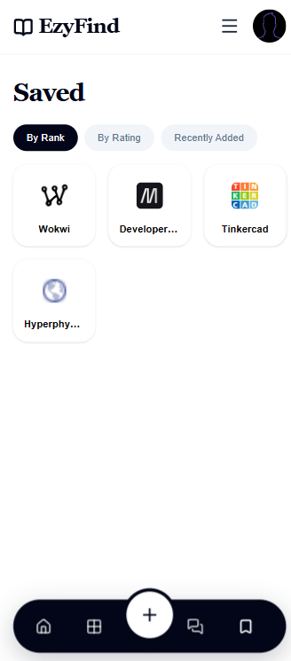

# EzyFind


EzyFind is a student-focused resource discovery and community queries app. Students can find useful links, browse by topic, save resources, vote on helpful resources, share links, and ask the campus community for help.

## Usage Guide

<table>
  <tr>
    <td width="50%" valign="top">

### 1. Splash screen



The splash screen gives users two ways to enter EzyFind:

- Continue as a guest to explore public content.
- Sign in with Google to save resources, vote, post queries, and contact users.

    </td>
    <td width="50%" valign="top">

### 2. Explore page



The Explore page contains top-liked tools and current campus queries. Use the bottom navigation to move between the main areas of the app.

 </td>
  </tr>

  <tr>
    <td width="50%" valign="top">

### 3. Categories



Open Categories to browse resource sections. Use the horizontal tags, grouped filters, multi-select filters, and search to find a category quickly.

</td>
    <td width="50%" valign="top">

### 4. Resource page



A category resource page contains all resources for that section, ordered by helpfulness by default. Users can search, sort, vote, save, share, or open a resource.

</td>
  </tr>

  <tr>
    <td width="50%" valign="top">

### 5. Add button



The add button opens the creation flow, where users can choose between:

- **Ask a Query**
- **Share a Resource**

Both forms support authenticated posting, validation, and mobile-friendly sheet interactions.

</td>
<td width="50%" valign="top">

### 6. Query page



The Queries page contains active campus questions. Press a query tile to view its description, share it, or contact the author through WhatsApp when authenticated contact details are available.

</td>
  </tr>

<tr>
<td width="50%" valign="top">

### 7. Saved page



The Saved page contains tools bookmarked by the signed-in user. Users can sort saved resources and open them directly from the saved grid.

</td>
    <td width="50%" valign="top">

</td>
  </tr>
</table>

## Setup

### Requirements

- Node.js 20 or newer
- npm
- A Supabase project
- Google OAuth configured in Supabase for authentication

### Install and run

1. Install dependencies:

   ```bash
   npm install
   ```

2. Create `.env.local` in the project root:

   ```env
   NEXT_PUBLIC_SUPABASE_URL=https://your-project.supabase.co
   NEXT_PUBLIC_SUPABASE_ANON_KEY=your-anon-key
   NEXT_PUBLIC_SITE_URL=http://localhost:3000
   NEXT_PUBLIC_API_BASE_URL=/api/v1
   ```

3. Configure the Supabase Google provider and add this callback URL to the allowed redirect URLs:

   ```text
   http://localhost:3000/auth/callback
   ```

4. Start the development server:

   ```bash
   npm run dev
   ```

5. Open [http://localhost:3000](http://localhost:3000).

### Useful commands

```bash
npm run dev          # Start the development server
npm run build        # Create a production build
npm run start        # Start the production server
npm run lint         # Run ESLint
npx tsc --noEmit     # Typecheck without emitting files
```

## Contributing

1. Fork the repository and create a feature branch.
2. Install dependencies with `npm install`.
3. Make focused changes that follow the existing component and styling patterns.
4. Run validation before opening a pull request:

   ```bash
   npx tsc --noEmit
   npm run lint
   npm run build
   ```

5. Open a pull request with a clear description, screenshots for visual changes, and any setup or migration notes.

Please do not commit secrets, `.env.local`, generated build output, or unrelated formatting changes.

## License

EzyFind is available under the [MIT License](LICENSE).

Made with ❤️ by Adithyan A S
